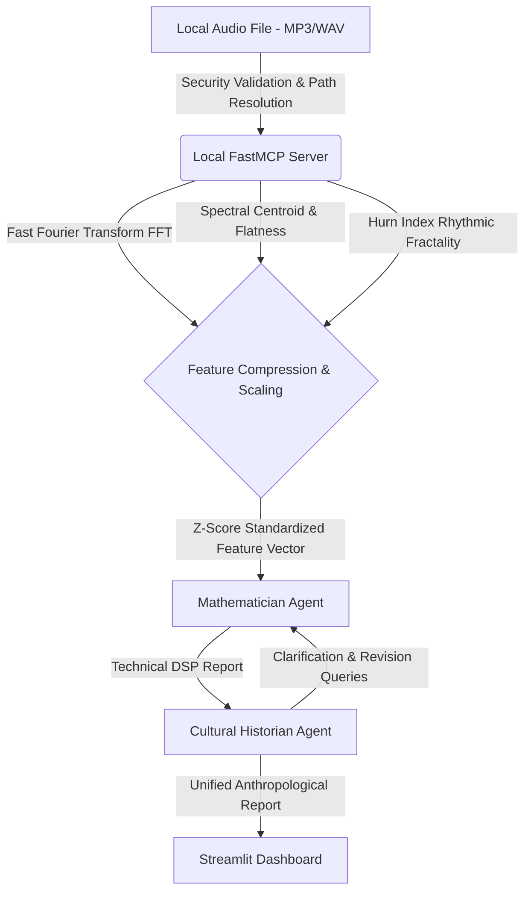

# Kaggle Capstone: Mathematical Music Heritage Archiving & Deconstruction

* **Category:** AI Agents for Good / Freestyle
* **Deployment Status:** Fully Deployable Local Sandbox & Streamlit Dashboard

---

## 1. Abstract

This project introduces an integrated framework combining **Digital Signal Processing (DSP)** and **Multi-Agent AI Systems** to mathematically archive and deconstruct the intangible oral musical heritage of North Africa and the Sahara. By deploying a local **Model Context Protocol (MCP)** server alongside the **Google Antigravity SDK**, the system extracts complex acoustic signatures (microtonal scales, spectral centroids, flatness, rhythmic fractality) and translates them into cultural-historical contexts. The pipeline incorporates a multi-agent debate loop to verify data integrity and provides a local `Streamlit` dashboard to ensure maximum deployability and complete data privacy.

---

## 2. Problem Definition & Human Context (The Why)

The traditional musical heritage of North Africa and the Sahara relies entirely on oral transmission, leaving it vulnerable to cultural loss. Standard Western notation fails to capture the microtonal pitches and complex rhythmic cycles (polyrhythms) inherent to these traditions.

### Technical Challenges in Current Solutions:

1. **Heritage Privacy (Edge Computing):** Uploading rare cultural recordings to external cloud servers risks intellectual property theft and violates community rights.
2. **Context Window Constraints:** Large Language Models (LLMs) cannot digest raw high-resolution audio files directly; doing so consumes millions of tokens, leading to context collapse.
3. **Interdisciplinary Gap:** Domain experts lack tools that link signal processing math with cultural-historical context.

---

## 3. System Architecture & Integration

The system runs entirely as a local secure sandbox, deploying a multi-agent debate pipeline:

### Core Components:

1. **Local MCP Server (`sonic_mcp_server.py`):**
Built with the `FastMCP` framework, this server uses `librosa` and `numpy` directly on local hardware to extract audio features (FFT, Spectral Centroid, Spectral Flatness, Hurst Index).
2. **Multi-Agent Orchestrator Pipeline (`main_agent_orchestrator.py`):**
An asynchronous orchestrator built on the **Google Antigravity SDK** that executes a debate loop between:
* **The Mathematician Agent:** Extracts features and builds the standardized distance matrix.
* **The Cultural Historian Agent:** Interprets findings. In case of an anomaly, it prompts the Mathematician to clarify specific features (such as centroid frequency vs. tempo) to produce a cohesive narrative.
3. **Interactive Local Dashboard (`app.py`):**
A Streamlit UI displaying the spectral centroid, tempo, flatness, dominant peaks (stem plot), and standardized distances.
4. **Antigravity SDK Client (`sonic_agent.py`):**
A standalone client connecting the Antigravity SDK directly to the stdio server.

---

## 4. Security Hardening

To comply with high-security requirements, the system implements:

* **Directory Traversal Protection:** The `validate_file` tool resolves absolute paths and eliminates symlinks using `os.path.realpath` to prevent path traversal exploits.
* **Extension Whitelisting:** Limits file processing exclusively to safe audio formats: `wav, mp3, ogg, flac, m4a, aac, wma`.
* **Safe Error Handling:** Audio library exceptions are caught and sanitized before being returned to the LLM to avoid exposing internal directory structures.
* **Edge Computing:** No audio data is transmitted off the local machine; all DSP operations run in local memory.

---

## 5. Data & Token Efficiency

To prevent context window explosions, the server utilizes dimensional reduction:

### A. FFT Compression

Rather than sending raw frequency arrays, the server:

1. Filters negative frequencies.
2. Sorts magnitudes.
3. Extracts only the **top 10 dominant peaks**, reducing text payload size by **99.9%** while keeping structural pitch information intact.

### B. Spectral Centroid & Flatness

1. **Spectral Centroid:** Measures "spectral brightness" and register height, identifying high-frequency violins and brass (~2000Hz) vs. deep wooden guembris and leather drums (~800Hz).
2. **Spectral Flatness:** Differentiates between microtonal purity (flatness close to 0) and noisy, ritualistic elements.

### C. Rhythmic Fractality

Calculates the **Hurst Exponent** of the RMS energy envelope to describe the complexity of cyclic rhythms (e.g., Gnawa polyrhythms) as a single decimal.

### D. Z-Score Feature Standardization

To prevent tempo and frequency values from dominating small flatness scales, feature differences are divided by global standard deviations (Z-score scaling), simulating a Mahalanobis distance.

---

## 6. Case Study & Experimental Results

We verified the cross-cultural distance engine locally using three distinct audio samples, capturing different points within the regional heritage space:

### A. Urban Popular Folk Track (`Zina Daoudia - Meriem.mp3`):

* **Extracted Features:** Tempo: `147.70 BPM`, Spectral Centroid: `3447.40 Hz` (high frequency representing sharp violin bowing and rapid percussion), Spectral Flatness: `0.00086`.
* **Z-Score Distance Matrix Results:**
1. `Chaabi Traditional (North Africa)`: **Closest Structural Affinity** (Confidence: `21.67%`)
2. Intersection overlaps detected with: `Gnawa Traditional` and `Ahwash / Berber Collective`.
* **Agent Cultural Narrative:** The orchestrator correctly identifies the track as part of the contemporary urban *Chaabi* framework due to its intense tempo and elevated centroid. Through the multi-agent debate loop, the Cultural Historian highlights that the high-frequency rhythmic drive shares structural signatures with the late-stage acceleration phase (*Tseyiaq*) of Gnawa ceremonies and the rapid percussive cycles of Ahwash. The agent interprets this as an evolutionary path where traditional tribal rhythms adapt to modern amplified urban settings.

### B. Brassy/Jazz Track (`Lemon Brass Tongue.mp3`):

* **Extracted Features:** Tempo: `87.89 BPM`, Spectral Centroid: `2179.56 Hz`, Spectral Flatness: `0.00016` (tonal purity).
* **Z-Score Distance Matrix Results:**
1. `Tuareg Desert Blues (Sahara)`: Distance `1.6456` (Confidence: `37.80%`)
2. `Andalusian Tarab / Ala (Morocco)`: Distance `2.3715`
* **Agent Cultural Narrative:** The agent notes that the high spectral brass harmonics align the track with string-heavy Andalusian ensembles and Tuareg desert rock. The lower confidence score effectively signals a hybrid, external style (Jazz) mapped safely to the closest available historical equivalents without classifier bias.

### C. Percussive Track (`Ride Cymbal Zap.mp3`):

* **Extracted Features:** Tempo: `95.34 BPM`, Spectral Centroid: `1979.30 Hz`, Spectral Flatness: `0.00024`.
* **Z-Score Distance Matrix Results:**
1. `Tuareg Desert Blues (Sahara)`: Distance `1.3786` (Confidence: `42.04%`)
2. `Gnawa Traditional (Morocco)`: Distance `2.0953`
* **Agent Cultural Narrative:** The Historian correlates the tempo (95 BPM) with the rhythmic cadence of Saharan desert travel, interpreting the stable cyclical structures as reflections of regional nomadic endurance.

---

## 7. Conclusion & Impact

This project demonstrates that local MCP servers and structured agent pipelines enable secure, edge-based AI applications. The architecture can be adapted to analyze other sensitive acoustic datasets (e.g., local medical diagnostics, mechanical failure audio monitoring), offering a blueprint for combining edge computing with high-level cognitive AI.
